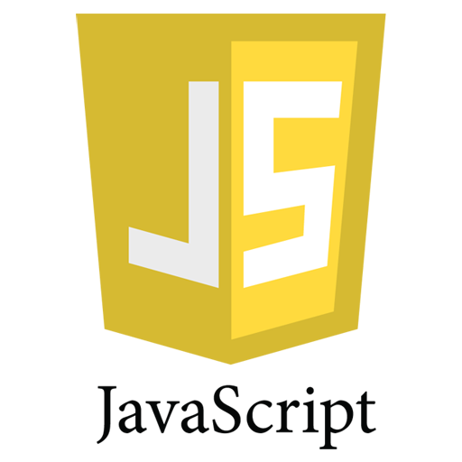

<h1 align="center">Loja Virtual</h1>

🚀 E-commerce de uma loja virtual como o objetivo de ampliar as vendas de empresas de diversos segmentos

<h1 align="center">Tabela de conteúdo </h1>

<!--ts-->
   * [Loja virtual](#lojaVirtual)
   * [Sobre](#Sobre)
   * [Andamento do projeto](#andamento-do-projeto)
   * [Funcionalidades do E-commerce](funcionalidades)
      * [Pre Requisitos](#pre-requisitos)
   * [Tecnologias](#tecnologias)
<!--te-->

<h1 align="center">Andamento do Projeto </h1>

<h4 align="center"> 
	🚧  E-commerce 🚀 Em construção...  🚧
</h4>

<h1 align="center"> Funcionalidades do E-commerce </h1>

- [x] Cadastro de usuário
- [x] Cadastro de cliente
- [x] Cadastro de produtos

<h1 align="center"> Pré-requisitos </h1>

Antes de começar, você vai precisar ter instalado em sua máquina as seguintes ferramentas:
[Git](https://git-scm.com), [Node.js](https://nodejs.org/en/). 
Além disto é bom ter um editor para trabalhar com o código como [VSCode](https://code.visualstudio.com/)

<h1 align="center"> 🛠 Tecnologias </h1>

 v4.17.1
v6.5.1
 v2.18.1
 v5.2.1

